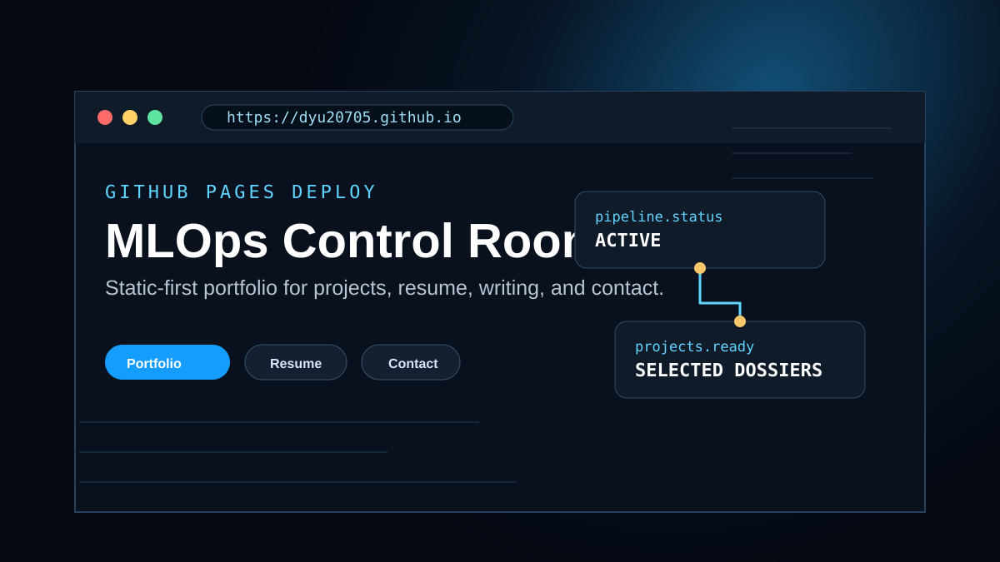

<div align="center">
  

  # Dyu20705.github.io

  **A static-first engineering portfolio for Nguyễn Văn Duy — a Computer Science student developing toward MLOps and platform engineering.**

  [](https://astro.build/)
  [](https://dyu20705.github.io)
  [](https://dyu20705.github.io)
</div>

## What this site is

This repository powers [dyu20705.github.io](https://dyu20705.github.io), a personal portfolio focused on:

- MLOps, machine-learning systems, data pipelines, CI/CD, observability and reliability.
- Honest project storytelling that separates current evidence from planned work.
- Bilingual VI/EN content for local and international reviewers.
- Static Astro output with minimal client-side JavaScript.
- Reproducible GitHub Pages deployment from the npm lockfile.

The visual direction is **Calm Control Room**: technical and distinctive, but content and evidence must remain more important than dashboard decoration.

## Main routes

| Route | Purpose |
| --- | --- |
| `/` and `/about` | Positioning, engineering focus and primary calls to action |
| `/portfolio` | Prioritized MLOps/Platform selected work |
| `/projects/[slug]` | Evidence-oriented project case studies |
| `/resume` and `/cv` | Resume and downloadable CV |
| `/blog` | Engineering notes |
| `/contact` | Email and professional links |

## Technology

- **Framework:** Astro 6.
- **Content:** validated Astro content collections for blog posts and project case studies.
- **Styling:** global tokens plus scoped Astro CSS.
- **Images:** `astro:assets` where real visual evidence exists.
- **Deployment:** GitHub Actions and GitHub Pages.
- **Runtime dependencies:** no client UI framework.

## Local development

Use the lockfile for a reproducible install:

```bash
npm ci
npm run dev
```

Build and validate the generated site:

```bash
npm run verify
```

`verify` runs the Astro production build and a dependency-free validator that checks generated landmarks and internal routes.

Preview the production build:

```bash
npm run preview
```

## CI/CD

Pull requests and pushes to `main` run:

```text
npm ci
npm run build
node scripts/validate-build.mjs
```

GitHub Pages deploys only from `main` after the quality job succeeds. The deploy job alone receives `pages: write` and `id-token: write` permissions.

## Content rules

- Do not invent years of experience, scale, users, benchmarks, certifications, testimonials or production results.
- Mark work as prototype, research, work in progress or completed based on current evidence.
- Keep problem, constraints, role, architecture, validation, failure modes and current results visible in case studies.
- Update Vietnamese and English copy together.
- Publish links only when the referenced repository, report or demo exists.
- Do not expose unnecessary personal information.

## Audit and implementation notes

- [Portfolio baseline audit](docs/portfolio-audit.md)
- [Portfolio upgrade plan](docs/portfolio-upgrade-plan.md)
- [Security policy](SECURITY.md)

Large layout/i18n/performance changes are intentionally separated into follow-up issues so they can be validated with browser, keyboard and responsive regression testing rather than bundled into an unsafe rewrite.
